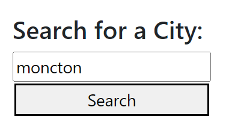
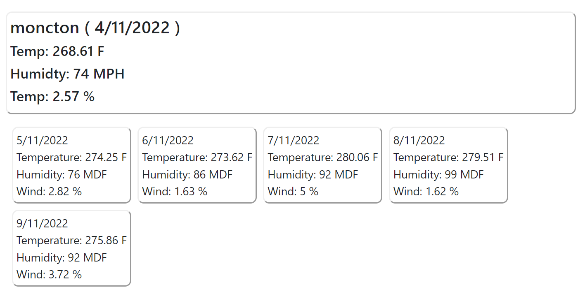
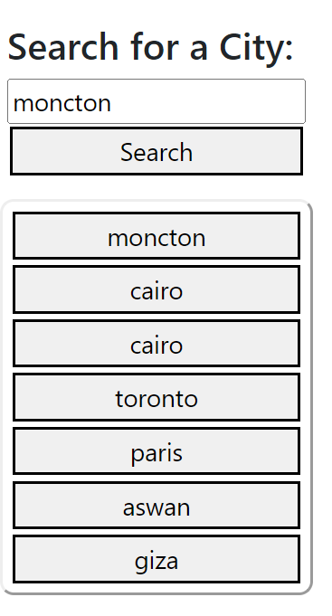

# 5days-weather
it shows the weather of a certain city and displays weather predictions for next 5 days 

# Deployed URL
 https://shaimaaghamry.github.io/5days-weather/

# User Scenrios
when the user open the weather application, the weather dashboard will be loaded and then the user should specify a city to display the weather of this city

the weather displayed in 2 parts: fitrst part diplay the current weather
and the second part is the weather of the next five days

After user determines the city to display its weather, the selected city will be stored in the local storage to be retrieved and displayed as a favorit city list

when the user select a city from the favorit list , then the weather will be displayed of that city         

